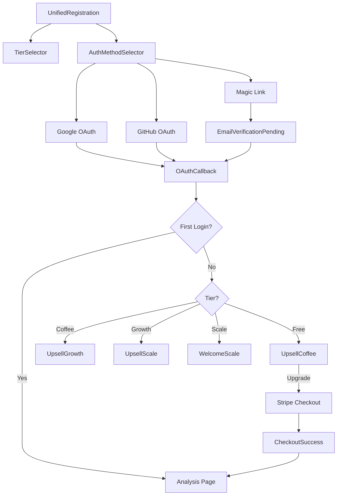

# AImpactScanner Developer Guide

**Version**: 2.0
**Last Updated**: 2025-10-02
**Status**: OAuth-First Authentication & Monetization System

---

## Table of Contents

1. [System Architecture Overview](#system-architecture-overview)
2. [Component Hierarchy](#component-hierarchy)
3. [Authentication Flow](#authentication-flow)
4. [Routing Logic](#routing-logic)
5. [Database Schema](#database-schema)
6. [API Reference](#api-reference)
7. [Environment Variables](#environment-variables)
8. [Local Development Setup](#local-development-setup)
9. [Testing Guide](#testing-guide)
10. [Deployment Procedures](#deployment-procedures)

---

## System Architecture Overview

### High-Level Architecture

```
┌─────────────────────────────────────────────────────────────┐
│                     CLIENT (React SPA)                       │
│  ┌────────────────────────────────────────────────────┐    │
│  │  Landing Page → Signup → OAuth/Magic Link          │    │
│  │  Context Storage (localStorage)                     │    │
│  │  Post-Auth Routing → Stripe Checkout (if needed)   │    │
│  │  Analysis Dashboard → PDF Export (Coffee+)          │    │
│  └────────────────────────────────────────────────────┘    │
└─────────────────────────────────────────────────────────────┘
                            ↓↑
┌─────────────────────────────────────────────────────────────┐
│                   SUPABASE BACKEND                           │
│  ┌──────────────┐  ┌──────────────┐  ┌──────────────┐     │
│  │ Auth Service │  │  PostgreSQL  │  │ Edge Functions│     │
│  │ (OAuth, OTP) │  │  (RLS, Users)│  │ (Webhooks)   │     │
│  └──────────────┘  └──────────────┘  └──────────────┘     │
└─────────────────────────────────────────────────────────────┘
                            ↓↑
┌─────────────────────────────────────────────────────────────┐
│                  EXTERNAL SERVICES                           │
│  ┌──────────────┐  ┌──────────────┐  ┌──────────────┐     │
│  │ Stripe API   │  │ Google OAuth │  │ GitHub OAuth │     │
│  │ (Payments)   │  │              │  │              │     │
│  └──────────────┘  └──────────────┘  └──────────────┘     │
└─────────────────────────────────────────────────────────────┘
```

### Design Principles

1. **Security-First**: Work WITH existing RLS policies, never bypass
2. **Graceful Degradation**: Never block users due to payment/auth failures
3. **Context Preservation**: Maintain user journey through all redirects
4. **OAuth-First**: Google/GitHub primary, Magic Link fallback
5. **Tier-Based Routing**: Show appropriate upsell based on user tier

---

## Component Hierarchy

### Authentication Components

```
src/
├── components/
│   ├── UnifiedRegistration.jsx         # Container for signup flow
│   │   ├── TierSelector.jsx            # Tier selection UI
│   │   └── AuthMethodSelector.jsx      # OAuth + Magic Link buttons
│   │       ├── OAuthButton (Google)    # Inline component
│   │       ├── OAuthButton (GitHub)    # Inline component
│   │       └── MagicLinkForm           # Email input + send
│   │
│   ├── OAuthCallback.jsx               # Post-OAuth routing handler
│   ├── Login.jsx                       # Login page (reuses AuthMethodSelector)
│   └── EmailVerificationPending.jsx    # Magic Link confirmation
│
├── pages/
│   ├── UpsellCoffee.jsx                # Free → Coffee upsell
│   ├── UpsellGrowth.jsx                # Coffee → Growth waitlist
│   ├── UpsellScale.jsx                 # Growth → Scale waitlist
│   ├── WelcomeScale.jsx                # Scale tier welcome page
│   ├── CheckoutSuccess.jsx             # Post-payment success
│   └── CheckoutCancel.jsx              # Payment cancellation
│
└── utils/
    ├── authRouting.js                  # Routing decision logic
    ├── authHelpers.js                  # Context storage helpers
    └── stripeHelpers.js                # Stripe integration
```

### Component Relationships



---

## Authentication Flow

### OAuth Flow (Google/GitHub)

```
1. USER INITIATES SIGNUP
   ├─ Landing.jsx: User enters URL → storeAnalysisContext(url)
   ├─ Navigate to /register
   └─ UnifiedRegistration.jsx renders

2. TIER SELECTION
   ├─ TierSelector: User selects tier (free/coffee/growth/scale)
   └─ State: selectedTier stored

3. AUTH METHOD SELECTION
   ├─ AuthMethodSelector: User clicks "Continue with Google"
   ├─ storeAuthContext(selectedTier, pendingAnalysisUrl)
   └─ supabase.auth.signInWithOAuth({ provider: 'google' })

4. OAUTH REDIRECT TO PROVIDER
   ├─ Browser redirects to Google consent screen
   ├─ User grants permissions
   └─ Google redirects to: https://<supabase-url>/auth/v1/callback

5. SUPABASE PROCESSES OAUTH
   ├─ Supabase validates OAuth response
   ├─ Creates or updates auth.users record
   ├─ Creates session with JWT token
   └─ Redirects to: https://aimpactscanner.com/#/oauth-callback

6. POST-AUTH ROUTING
   ├─ OAuthCallback.jsx: useEffect triggered
   ├─ getSession() → retrieve user session
   ├─ getAuthContext() → retrieve stored tier/URL
   ├─ Query database for user profile (tier, is_first_login)
   └─ Call routing decision function

7. ROUTING DECISION
   ├─ IF is_first_login = true:
   │   ├─ IF selectedTier = 'coffee':
   │   │   └─ Navigate to Stripe checkout
   │   └─ ELSE:
   │       └─ Navigate to /analyze (with pre-filled URL if context exists)
   └─ IF is_first_login = false:
       └─ Navigate to tier-based upsell page

8. POST-CHECKOUT (IF COFFEE TIER)
   ├─ Stripe webhook: checkout.session.completed
   ├─ Edge Function: Update user tier to 'coffee'
   ├─ CheckoutSuccess.jsx: Poll for tier update
   └─ Navigate to /analyze with unlimited access
```

### Magic Link Flow

```
1. USER INITIATES SIGNUP
   ├─ Same as OAuth (steps 1-2)
   └─ AuthMethodSelector: User clicks "Continue with Email"

2. EMAIL INPUT
   ├─ User enters email address
   ├─ Validate email format
   └─ Click "Send Magic Link"

3. MAGIC LINK GENERATION
   ├─ supabase.auth.signInWithOtp({ email })
   ├─ Supabase generates secure token (128-bit)
   ├─ Supabase sends email via configured SMTP (Resend)
   └─ EmailVerificationPending.jsx renders

4. EMAIL DELIVERY
   ├─ User receives email within 30 seconds
   ├─ Email contains magic link: https://aimpactscanner.com/#/oauth-callback?token=<token>
   └─ Link expires in 1 hour

5. MAGIC LINK CLICK
   ├─ User clicks link in email
   ├─ Supabase validates token
   ├─ Creates session
   └─ Redirects to OAuthCallback (same as OAuth step 6)

6. POST-AUTH ROUTING
   └─ Same routing logic as OAuth (steps 7-8)
```

---

## Routing Logic

### Post-Signup Routing Decision Tree

```javascript
// File: /src/utils/authRouting.js

export function getPostSignupDestination(user, context) {
  // NEW USER (First Login)
  // Skip upsell, go straight to value

  const { selectedTier, pendingAnalysisUrl } = context || {};

  // If Coffee tier selected → Payment required
  if (selectedTier === 'coffee') {
    return {
      path: '/checkout',
      requiresPayment: true,
      tier: 'coffee',
      context: { pendingAnalysisUrl }
    };
  }

  // If URL context exists → Pre-populate analysis page
  if (pendingAnalysisUrl) {
    return {
      path: '/analyze',
      state: { prefilledUrl: pendingAnalysisUrl },
      source: 'landing_page_signup'
    };
  }

  // Default → Empty analysis page
  return {
    path: '/analyze',
    state: null,
    source: 'direct_signup'
  };
}
```

### Post-Login Routing Decision Tree

```javascript
// File: /src/utils/authRouting.js

export async function getPostLoginDestination(user, session) {
  // RETURNING USER (is_first_login = false)
  // Show tier-based upsell

  // Fetch user tier from database
  const { data: userData, error } = await supabase
    .from('users')
    .select('tier, is_first_login')
    .eq('id', user.id)
    .single();

  if (error || !userData) {
    console.error('Failed to fetch user data:', error);
    return { path: '/dashboard', fallback: true };
  }

  // If first login → Skip upsell (same as post-signup logic)
  if (userData.is_first_login) {
    await markFirstLoginComplete(user.id);
    return getPostSignupDestination(user, getAuthContext());
  }

  // Show tier-based upsell
  return getUpsellPage(userData);
}

function getUpsellPage(userData) {
  switch (userData.tier) {
    case 'free':
      return { path: '/upsell/coffee' };
    case 'coffee':
      return { path: '/upsell/growth' };
    case 'growth':
      return { path: '/upsell/scale' };
    case 'scale':
      return { path: '/welcome/scale' };
    default:
      console.warn('Unknown tier:', userData.tier);
      return { path: '/dashboard', fallback: true };
  }
}
```

### Context Storage Functions

```javascript
// File: /src/utils/authHelpers.js

export function storeAuthContext(selectedTier, pendingAnalysisUrl = null) {
  const context = {
    selectedTier,
    pendingAnalysisUrl: pendingAnalysisUrl || localStorage.getItem('pendingAnalysisUrl'),
    pendingAnalysisId: localStorage.getItem('pendingAnalysisId'),
    timestamp: Date.now(),
    expiresAt: Date.now() + (24 * 60 * 60 * 1000) // 24 hours
  };

  try {
    localStorage.setItem('authContext', JSON.stringify(context));
    localStorage.setItem('authContextExpiry', context.expiresAt.toString());
    console.log('✅ Auth context stored:', context);
  } catch (error) {
    console.warn('⚠️ localStorage unavailable:', error);
    sessionStorage.setItem('authContext', JSON.stringify(context));
  }
}

export function getAuthContext() {
  try {
    const stored = localStorage.getItem('authContext') ||
                   sessionStorage.getItem('authContext');

    if (!stored) return null;

    const context = JSON.parse(stored);
    const now = Date.now();

    // Check expiry
    if (context.expiresAt && now > context.expiresAt) {
      console.log('⏰ Auth context expired, clearing...');
      clearAuthContext();
      return null;
    }

    return context;
  } catch (error) {
    console.error('❌ Error retrieving auth context:', error);
    return null;
  }
}

export function clearAuthContext() {
  localStorage.removeItem('authContext');
  localStorage.removeItem('authContextExpiry');
  sessionStorage.removeItem('authContext');
  console.log('🧹 Auth context cleared');
}

export function storePendingAnalysis(url, id = null) {
  try {
    localStorage.setItem('pendingAnalysisUrl', url);
    if (id) {
      localStorage.setItem('pendingAnalysisId', id);
    }
    console.log('✅ Pending analysis stored:', { url, id });
  } catch (error) {
    console.warn('⚠️ localStorage unavailable:', error);
  }
}

export function getPendingAnalysis() {
  try {
    const url = localStorage.getItem('pendingAnalysisUrl');
    const id = localStorage.getItem('pendingAnalysisId');
    return url ? { url, id } : null;
  } catch (error) {
    console.error('❌ Error retrieving pending analysis:', error);
    return null;
  }
}

export function clearPendingAnalysis() {
  localStorage.removeItem('pendingAnalysisUrl');
  localStorage.removeItem('pendingAnalysisId');
  localStorage.removeItem('landingAnalysisData');
  console.log('🧹 Pending analysis cleared');
}
```

---

## Database Schema

### Users Table (Enhanced)

```sql
-- Table: public.users
-- Purpose: User profiles with authentication and tier management

CREATE TABLE users (
  -- Existing columns
  id UUID PRIMARY KEY REFERENCES auth.users(id) ON DELETE CASCADE,
  email TEXT UNIQUE NOT NULL,
  display_name TEXT,
  tier TEXT DEFAULT 'free' NOT NULL,
  analyses_count INTEGER DEFAULT 0,
  analyses_this_month INTEGER DEFAULT 0,
  last_reset_date DATE,
  created_at TIMESTAMPTZ DEFAULT NOW(),
  updated_at TIMESTAMPTZ DEFAULT NOW(),

  -- NEW: Authentication tracking
  auth_provider TEXT,
  -- Values: 'google', 'github', 'email' (magic link)

  -- NEW: Tier management
  selected_tier TEXT DEFAULT 'free',
  -- Tier selected during signup (may differ from current tier during payment)

  subscription_status TEXT DEFAULT 'active',
  -- Values: 'active', 'pending_payment', 'canceled', 'past_due'

  -- NEW: Stripe integration
  stripe_customer_id TEXT UNIQUE,
  stripe_subscription_id TEXT UNIQUE,

  -- NEW: Journey tracking
  is_first_login BOOLEAN DEFAULT true,
  -- Skip upsell on first login after signup

  signup_source TEXT,
  -- Values: 'landing_url_entry', 'direct_signup', etc.

  -- NEW: Waitlist flags
  growth_waitlist BOOLEAN DEFAULT false,
  scale_waitlist BOOLEAN DEFAULT false,
  waitlist_joined_at TIMESTAMPTZ,

  -- NEW: Analytics
  last_upsell_shown TIMESTAMPTZ,
  upsell_dismissed_count INTEGER DEFAULT 0
);

-- Indexes for performance
CREATE INDEX idx_users_auth_provider ON users(auth_provider);
CREATE INDEX idx_users_tier ON users(tier);
CREATE INDEX idx_users_subscription_status ON users(subscription_status);
CREATE INDEX idx_users_stripe_customer_id ON users(stripe_customer_id);
CREATE INDEX idx_users_is_first_login ON users(is_first_login) WHERE is_first_login = true;
```

### Waitlist Table (New)

```sql
-- Table: public.waitlist
-- Purpose: Track Growth/Scale tier waitlist interest

CREATE TABLE waitlist (
  id UUID PRIMARY KEY DEFAULT gen_random_uuid(),
  user_id UUID NOT NULL REFERENCES auth.users(id) ON DELETE CASCADE,
  email TEXT NOT NULL,
  current_tier TEXT NOT NULL,
  interested_tier TEXT NOT NULL CHECK (interested_tier IN ('growth', 'scale')),
  joined_at TIMESTAMPTZ NOT NULL DEFAULT NOW(),
  notified BOOLEAN DEFAULT false,
  notified_at TIMESTAMPTZ,
  metadata JSONB DEFAULT '{}',
  UNIQUE(user_id, interested_tier)
);

-- RLS Policies
ALTER TABLE waitlist ENABLE ROW LEVEL SECURITY;

CREATE POLICY "Users can view own waitlist entries"
  ON waitlist FOR SELECT
  USING (auth.uid() = user_id);

CREATE POLICY "Users can insert own waitlist entries"
  ON waitlist FOR INSERT
  WITH CHECK (auth.uid() = user_id);

-- Indexes
CREATE INDEX idx_waitlist_user_id ON waitlist(user_id);
CREATE INDEX idx_waitlist_interested_tier ON waitlist(interested_tier);
CREATE INDEX idx_waitlist_notified ON waitlist(notified) WHERE notified = false;
```

### Database Helper Functions

```sql
-- Function: join_waitlist
-- Purpose: Add user to Growth/Scale waitlist

CREATE OR REPLACE FUNCTION join_waitlist(
  p_interested_tier TEXT
)
RETURNS TABLE (
  success BOOLEAN,
  message TEXT,
  waitlist_id UUID
)
LANGUAGE plpgsql
SECURITY DEFINER
SET search_path = public
AS $$
DECLARE
  v_user_id UUID;
  v_email TEXT;
  v_current_tier TEXT;
  v_waitlist_id UUID;
BEGIN
  -- Get authenticated user
  v_user_id := auth.uid();

  IF v_user_id IS NULL THEN
    RETURN QUERY SELECT false, 'Not authenticated', NULL::UUID;
    RETURN;
  END IF;

  -- Get user details
  SELECT email, tier INTO v_email, v_current_tier
  FROM users
  WHERE id = v_user_id;

  -- Validate tier
  IF p_interested_tier NOT IN ('growth', 'scale') THEN
    RETURN QUERY SELECT false, 'Invalid tier', NULL::UUID;
    RETURN;
  END IF;

  -- Insert or ignore if already exists
  INSERT INTO waitlist (user_id, email, current_tier, interested_tier)
  VALUES (v_user_id, v_email, v_current_tier, p_interested_tier)
  ON CONFLICT (user_id, interested_tier) DO NOTHING
  RETURNING id INTO v_waitlist_id;

  IF v_waitlist_id IS NULL THEN
    RETURN QUERY SELECT true, 'Already on waitlist', NULL::UUID;
  ELSE
    -- Update user waitlist flags
    UPDATE users
    SET
      growth_waitlist = (p_interested_tier = 'growth') OR growth_waitlist,
      scale_waitlist = (p_interested_tier = 'scale') OR scale_waitlist,
      waitlist_joined_at = COALESCE(waitlist_joined_at, NOW())
    WHERE id = v_user_id;

    RETURN QUERY SELECT true, 'Added to waitlist', v_waitlist_id;
  END IF;
END $$;
```

---

## API Reference

### Supabase Client Methods

#### Authentication

```javascript
import { supabase } from './lib/supabaseClient';

// Google OAuth
await supabase.auth.signInWithOAuth({
  provider: 'google',
  options: {
    redirectTo: `${window.location.origin}/#/oauth-callback`,
    scopes: 'email profile'
  }
});

// GitHub OAuth
await supabase.auth.signInWithOAuth({
  provider: 'github',
  options: {
    redirectTo: `${window.location.origin}/#/oauth-callback`,
    scopes: 'user:email'
  }
});

// Magic Link
await supabase.auth.signInWithOtp({
  email: userEmail,
  options: {
    emailRedirectTo: `${window.location.origin}/#/oauth-callback`,
    data: {
      selected_tier: selectedTier // Pass tier to user_metadata
    }
  }
});

// Get Session
const { data: { session }, error } = await supabase.auth.getSession();

// Sign Out
await supabase.auth.signOut();
```

#### Database Queries

```javascript
// Fetch user profile
const { data: user, error } = await supabase
  .from('users')
  .select('*')
  .eq('id', userId)
  .single();

// Update tier after payment
const { error } = await supabase
  .from('users')
  .update({
    tier: 'coffee',
    subscription_status: 'active',
    stripe_customer_id: customerId,
    stripe_subscription_id: subscriptionId
  })
  .eq('id', userId);

// Mark first login complete
const { error } = await supabase
  .from('users')
  .update({ is_first_login: false })
  .eq('id', userId);

// Join waitlist (using RPC function)
const { data, error } = await supabase.rpc('join_waitlist', {
  p_interested_tier: 'growth'
});
```

### Stripe API (Edge Functions)

#### Create Checkout Session

```javascript
// File: supabase/functions/create-checkout-session/index.ts

import Stripe from 'stripe';

const stripe = new Stripe(Deno.env.get('STRIPE_SECRET_KEY')!, {
  apiVersion: '2023-10-16'
});

export async function createCheckoutSession(userId, userEmail, tier, metadata = {}) {
  const session = await stripe.checkout.sessions.create({
    customer_email: userEmail,
    mode: 'subscription',
    payment_method_types: ['card'],
    line_items: [
      {
        price: Deno.env.get('STRIPE_COFFEE_PRICE_ID'), // Price ID from Stripe Dashboard
        quantity: 1
      }
    ],
    success_url: `${Deno.env.get('APP_URL')}/checkout-success?session_id={CHECKOUT_SESSION_ID}`,
    cancel_url: `${Deno.env.get('APP_URL')}/checkout-cancel`,
    metadata: {
      user_id: userId,
      tier: tier,
      ...metadata
    }
  });

  return session;
}
```

#### Webhook Handler

```javascript
// File: supabase/functions/stripe-webhook/index.ts

import Stripe from 'stripe';
import { createClient } from '@supabase/supabase-js';

const stripe = new Stripe(Deno.env.get('STRIPE_SECRET_KEY')!, {
  apiVersion: '2023-10-16'
});

const supabase = createClient(
  Deno.env.get('SUPABASE_URL')!,
  Deno.env.get('SUPABASE_SERVICE_ROLE_KEY')!
);

export async function handleWebhook(req: Request) {
  const signature = req.headers.get('stripe-signature');
  const body = await req.text();

  let event;
  try {
    event = stripe.webhooks.constructEvent(
      body,
      signature!,
      Deno.env.get('STRIPE_WEBHOOK_SECRET')!
    );
  } catch (err) {
    console.error('⚠️ Webhook signature verification failed:', err.message);
    return new Response('Webhook Error', { status: 400 });
  }

  switch (event.type) {
    case 'checkout.session.completed':
      await handleCheckoutComplete(event.data.object);
      break;

    case 'customer.subscription.deleted':
      await handleSubscriptionCanceled(event.data.object);
      break;

    case 'invoice.payment_failed':
      await handlePaymentFailed(event.data.object);
      break;

    default:
      console.log(`Unhandled event type: ${event.type}`);
  }

  return new Response(JSON.stringify({ received: true }), { status: 200 });
}

async function handleCheckoutComplete(session: Stripe.Checkout.Session) {
  const { user_id, tier } = session.metadata!;

  const { error } = await supabase
    .from('users')
    .update({
      tier: tier,
      subscription_status: 'active',
      stripe_customer_id: session.customer as string,
      stripe_subscription_id: session.subscription as string,
      updated_at: new Date().toISOString()
    })
    .eq('id', user_id);

  if (error) {
    console.error('❌ Failed to update user tier:', error);
  } else {
    console.log(`✅ User ${user_id} upgraded to ${tier}`);
  }
}

async function handleSubscriptionCanceled(subscription: Stripe.Subscription) {
  const { error } = await supabase
    .from('users')
    .update({
      subscription_status: 'canceled',
      updated_at: new Date().toISOString()
    })
    .eq('stripe_subscription_id', subscription.id);

  if (error) {
    console.error('❌ Failed to cancel subscription:', error);
  } else {
    console.log(`✅ Subscription ${subscription.id} canceled`);
  }
}
```

---

## Environment Variables

### Client-Side (.env)

```bash
# Supabase
VITE_SUPABASE_URL=https://pdmtvkcxnqysujnpcnyh.supabase.co
VITE_SUPABASE_ANON_KEY=<supabase_anon_key>

# Stripe
VITE_STRIPE_PUBLIC_KEY=pk_live_<stripe_public_key>
VITE_STRIPE_COFFEE_PRICE_ID=price_<stripe_price_id>

# App
VITE_APP_URL=https://aimpactscanner.com
```

### Server-Side (Supabase Secrets)

```bash
# Stripe
STRIPE_SECRET_KEY=sk_live_<stripe_secret_key>
STRIPE_WEBHOOK_SECRET=whsec_<webhook_secret>
STRIPE_COFFEE_PRICE_ID=price_<stripe_price_id>

# Supabase
SUPABASE_URL=https://pdmtvkcxnqysujnpcnyh.supabase.co
SUPABASE_SERVICE_ROLE_KEY=<service_role_key>

# App
APP_URL=https://aimpactscanner.com

# SMTP (Resend for Magic Links)
RESEND_API_KEY=re_<resend_api_key>
```

### Setting Supabase Secrets

```bash
# Using Supabase CLI
supabase secrets set STRIPE_SECRET_KEY=sk_live_...
supabase secrets set STRIPE_WEBHOOK_SECRET=whsec_...
supabase secrets set RESEND_API_KEY=re_...

# Verify secrets
supabase secrets list
```

---

## Local Development Setup

### Prerequisites

- Node.js 18+ and npm
- Supabase CLI
- Stripe CLI (for webhook testing)
- Git

### Setup Steps

```bash
# 1. Clone repository
git clone https://github.com/your-org/aimpactscanner-mvp.git
cd aimpactscanner-mvp

# 2. Install dependencies
npm install

# 3. Copy environment template
cp .env.example .env

# 4. Configure .env with your keys
# Edit .env and add Supabase and Stripe keys

# 5. Start Supabase local instance (optional)
supabase start

# 6. Run database migrations
supabase db push

# 7. Start development server
npm run dev

# Development server runs at http://localhost:5173
```

### Testing OAuth Locally

OAuth providers require HTTPS redirects. Use one of these approaches:

**Option 1: ngrok (Recommended)**
```bash
# Install ngrok
npm install -g ngrok

# Start ngrok tunnel
ngrok http 5173

# Update OAuth redirect URIs in Google/GitHub to ngrok URL
# Example: https://abc123.ngrok.io/#/oauth-callback
```

**Option 2: localhost.run**
```bash
ssh -R 80:localhost:5173 localhost.run

# Use provided URL for OAuth redirect URIs
```

**Option 3: Supabase Auth Localhost**
- Use Supabase Auth localhost config
- Limited to Magic Link testing
- OAuth still requires public URL

### Testing Stripe Webhooks Locally

```bash
# 1. Install Stripe CLI
brew install stripe/stripe-cli/stripe
# or download from https://stripe.com/docs/stripe-cli

# 2. Login to Stripe
stripe login

# 3. Forward webhooks to local Edge Function
stripe listen --forward-to http://localhost:54321/functions/v1/stripe-webhook

# 4. Copy webhook signing secret shown in terminal
# Add to .env as STRIPE_WEBHOOK_SECRET

# 5. Trigger test events
stripe trigger checkout.session.completed
```

---

## Testing Guide

### Manual Testing Checklist

**Authentication Flow**:
- [ ] Google OAuth signup creates user correctly
- [ ] GitHub OAuth signup creates user correctly
- [ ] Magic Link sent within 30 seconds
- [ ] Magic Link login works correctly
- [ ] OAuth login works for existing users

**Context Preservation**:
- [ ] URL entered on landing page pre-fills after signup
- [ ] Context persists through OAuth redirects
- [ ] Context expires after 24 hours
- [ ] Context clears after use

**Routing Logic**:
- [ ] First login skips upsell (goes to analysis page)
- [ ] Second login shows correct upsell based on tier
- [ ] Coffee tier upgrade redirects to Stripe checkout
- [ ] Post-payment redirects to analysis page

**Stripe Integration**:
- [ ] Checkout session created successfully
- [ ] Payment succeeds and tier updates
- [ ] Webhook processes within 5 seconds
- [ ] Payment failure keeps user on Free tier
- [ ] Subscription cancellation works correctly

**Waitlist**:
- [ ] Coffee users can join Growth waitlist
- [ ] Growth users can join Scale waitlist
- [ ] Duplicate joins prevented
- [ ] Waitlist confirmation shown

### Automated Testing

```bash
# Run all tests
npm run test

# Run specific test suite
npm run test:unit        # Unit tests
npm run test:integration # Integration tests
npm run test:e2e         # End-to-end tests (Playwright)

# Run with coverage
npm run test:coverage

# Run accessibility tests
npm run test:a11y
```

### Test Files

```
tests/
├── unit/
│   ├── authHelpers.test.js          # Context storage functions
│   ├── authRouting.test.js          # Routing decision logic
│   └── components/
│       ├── TierSelector.test.jsx
│       └── AuthMethodSelector.test.jsx
│
├── integration/
│   ├── auth-flow.test.js            # Complete auth flows
│   ├── payment-flow.test.js         # Stripe integration
│   └── waitlist.test.js             # Waitlist functionality
│
└── e2e/
    ├── user-journeys.spec.js        # Full user journeys
    ├── oauth-callback.spec.js       # OAuth callback handling
    └── checkout-success.spec.js     # Post-payment flow
```

---

## Deployment Procedures

### Pre-Deployment Checklist

- [ ] All tests passing
- [ ] Environment variables configured
- [ ] Database migrations deployed
- [ ] OAuth providers configured
- [ ] Stripe products created
- [ ] Webhook endpoints configured
- [ ] Edge Functions deployed
- [ ] Build succeeds locally
- [ ] No console errors in production build

### Deployment Steps

```bash
# 1. Build production bundle
npm run build

# 2. Test production build locally
npm run preview

# 3. Deploy database migrations
supabase db push --db-url <production_url>

# 4. Deploy Edge Functions
supabase functions deploy stripe-webhook
supabase functions deploy create-checkout-session

# 5. Set production secrets
supabase secrets set STRIPE_SECRET_KEY=sk_live_...
supabase secrets set STRIPE_WEBHOOK_SECRET=whsec_...

# 6. Deploy frontend (Netlify/Vercel)
git push origin main  # Triggers auto-deploy

# 7. Verify deployment
curl https://aimpactscanner.com/health
```

### Post-Deployment Verification

```bash
# 1. Test OAuth flows
# - Google OAuth signup
# - GitHub OAuth signup
# - Magic Link signup

# 2. Test Stripe integration
# - Create checkout session
# - Complete test payment
# - Verify webhook processed

# 3. Test routing
# - First login routing
# - Second login upsell
# - Context preservation

# 4. Monitor logs
supabase functions logs stripe-webhook
supabase functions logs create-checkout-session

# 5. Check error tracking
# - Sentry dashboard
# - Supabase logs
# - Stripe webhook logs
```

### Rollback Procedure

```bash
# 1. Revert to previous deployment
git revert HEAD
git push origin main

# 2. Rollback database migrations (if needed)
supabase db reset --db-url <production_url>

# 3. Notify users (if downtime occurred)
# - Post status update
# - Send email notification

# 4. Investigate root cause
# - Check logs
# - Review test results
# - Document issues
```

---

## Additional Resources

- [Supabase Auth Documentation](https://supabase.com/docs/guides/auth)
- [Stripe Checkout Documentation](https://stripe.com/docs/payments/checkout)
- [React Router Documentation](https://reactrouter.com)
- [Playwright Testing Documentation](https://playwright.dev)

---

**Last Updated**: 2025-10-02
**Version**: 2.0 (OAuth-First Authentication System)
